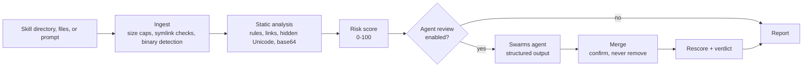

<div align="center">

# SkillScanner

**Security auditing for AI agent skills and prompts, before they reach your agents.**

Detect prompt injection, malicious links, data exfiltration, credential theft, hidden instructions,
and supply-chain risk in Claude Code, Codex, and MCP skills, then get an agent-reviewed verdict.

[](https://swarms.ai)
[](https://docs.swarms.world)
[](https://www.python.org)
[](LICENSE)
[](#deployment)
[](https://github.com/The-Swarm-Corporation/SkillScanner)

[](https://swarms.ai)
[](https://twitter.com/swarms_corp)
[](https://discord.gg/EamjgSaEQf)
[](https://www.linkedin.com/company/swarms-corp/)
[](https://www.youtube.com/@kyegomez3242)
[](https://t.me/swarmsgroupchat)

</div>

---

## Why SkillScanner

Agent skills are folders of instructions and scripts that coding agents load and execute with the
user's privileges. A single malicious `SKILL.md` can instruct an agent to read `~/.ssh`, pipe a remote
script into a shell, rewrite `CLAUDE.md` for persistence, or hide all of it from the user in invisible
Unicode. SkillScanner gives security and platform teams a gate in front of that trust boundary: scan
every skill and prompt before installation, in CI, or behind an internal marketplace.

## Key Capabilities

| Capability | Description |
| --- | --- |
| Deterministic static analysis | Fast, offline detection across 10+ threat categories. Never executes scanned content. |
| Malicious link analysis | Exfiltration endpoints, tunnels, paste sites, URL shorteners, raw and obfuscated IPs, homograph domains, `user@host` deception, and secrets interpolated into URLs. |
| Hidden content detection | Unicode tag-character smuggling (decoded and rescanned), bidi overrides, zero-width characters, and base64 payloads (decoded and rescanned). |
| Agent-powered semantic review | A [Swarms](https://swarms.ai) agent with structured output checks purpose fit, permission fit, sensitive access, and trigger abuse, then issues an `APPROVE` / `CAUTION` / `REJECT` verdict. |
| Tamper-resistant merging | The agent can confirm and enrich static findings but can never remove them. An `APPROVE` with unexplained HIGH or CRITICAL issues is downgraded to `CAUTION`. |
| Graceful degradation | If the model is unreachable, the static report is still returned with the failure recorded in `metadata.llm_error`. |
| Three integration surfaces | Python class API, REST API (FastAPI), and a Docker image. |

## Architecture



## Quick Start

```bash
git clone https://github.com/The-Swarm-Corporation/SkillScanner.git
cd SkillScanner
uv sync --extra api
export ANTHROPIC_API_KEY=...   # or the key for any LiteLLM-supported provider
```

```python
from skills_scanner import SkillScanner

scanner = SkillScanner(model_name="claude-sonnet-5")
report = scanner.scan("path/to/skill")

print(report.verdict)                  # APPROVE / CAUTION / REJECT
print(report.risk_assessment.score)    # 0-100
print(report.to_markdown())            # human-readable triage report
```

## Python API

`SkillScanner` is the single entry point.

| Method | Input | Use case |
| --- | --- | --- |
| `scan(path)` | Skill directory or single file on disk | Pre-install checks, CI |
| `scan_files(files, name)` | `{"SKILL.md": "...", "scripts/run.sh": "..."}` | Services, uploads, marketplaces |
| `scan_text(text, name)` | A single prompt or `SKILL.md` | Prompt review |

Every method accepts `use_agent=` to override the instance default per call.

| Constructor option | Default | Description |
| --- | --- | --- |
| `use_agent` | `True` | Run the agent review after static analysis |
| `model_name` | `"claude-sonnet-5"` | Any LiteLLM model identifier supported by Swarms |
| `trusted_domains` | `()` | Domains (and subdomains) exempt from link reputation checks |
| `harmful_terms` | `()` | Organization-specific words or phrases to flag as HIGH |
| `extra_rules` | `()` | Additional `Rule` objects (see [Extending](#extending)) |
| `max_file_bytes` | `1_000_000` | Files above this size are flagged, not read |
| `max_files` | `1_000` | Maximum files per scan |
| `agent_max_chars` | `150_000` | Content budget sent to the agent |

`report.verdict` returns the agent verdict when the review ran, otherwise the static recommendation
(`SAFE` / `CAUTION` / `DO_NOT_INSTALL`). Export with `report.to_json()` or `report.to_markdown()`.

## REST API

```bash
uv run --extra api uvicorn skills_scanner.api:app --host 0.0.0.0 --port 8000
```

| Method | Endpoint | Description |
| --- | --- | --- |
| `POST` | `/v1/scan` | End-to-end scan: static analysis, then the agent review |
| `POST` | `/v1/scan/static` | Static analysis only: deterministic, no LLM call |
| `GET` | `/health` | Liveness probe |

Interactive OpenAPI documentation is served at `/docs`.

**Request.** Send exactly one of `content` or `files`. Requests are limited to 1,000 files and 10 MB;
invalid requests return `422`.

```bash
curl -X POST http://localhost:8000/v1/scan \
  -H "Content-Type: application/json" \
  -d '{"name": "pdf-helper", "files": {"SKILL.md": "...", "scripts/setup.sh": "..."}}'
```

**Response.** Abridged:

```json
{
  "skill": { "name": "pdf-helper", "source": "pdf-helper", "scanned_at": "2026-09-28T10:00:00Z" },
  "risk_assessment": { "score": 60, "severity": "HIGH", "recommendation": "DO_NOT_INSTALL", "max_issue_severity": "HIGH" },
  "components": [
    { "path": "SKILL.md", "type": "skill_manifest", "lines": 12, "executable": false, "size_bytes": 540 }
  ],
  "issues": [
    {
      "id": "PI001",
      "category": "prompt_injection",
      "pattern": "Instruction override",
      "severity": "HIGH",
      "confidence": 0.8,
      "location": { "file": "SKILL.md", "start_line": 7, "end_line": null },
      "finding": "Ignore previous instructions",
      "remediation": "Remove instructions that override, conceal, or bypass the agent's rules; state behavior openly.",
      "tags": []
    }
  ],
  "overall_assessment": {
    "verdict": "REJECT",
    "risk_level": "HIGH",
    "summary": "...",
    "install_posture": "...",
    "sensitive_surface": ["network", "shell"],
    "diagnosis": "...",
    "guardrails": ["..."]
  },
  "metadata": {
    "has_executable_scripts": true,
    "skills_scanner_version": "0.1.0",
    "llm_requested": true,
    "llm_available": true,
    "meta_analysis_applied": true,
    "model": "claude-sonnet-5",
    "llm_error": null
  },
  "execution_successful": true
}
```

## Deployment

```bash
docker build -t skills-scanner .
docker run -d -p 8000:8000 \
  -e ANTHROPIC_API_KEY \
  -e SKILLS_SCANNER_MODEL=claude-sonnet-5 \
  skills-scanner
```

The image uses a locked dependency set (`uv.lock`), runs as a non-root user, and ships a container
health check against `/health`.

| Variable | Description |
| --- | --- |
| `SKILLS_SCANNER_MODEL` | Model used by `/v1/scan` (default `claude-sonnet-5`) |
| `ANTHROPIC_API_KEY`, `OPENAI_API_KEY`, ... | Credentials for the model provider |
| `WORKSPACE_DIR` | Swarms runtime workspace (defaults to `/tmp/agent_workspace` in the image) |
| `SWARMS_TELEMETRY_ON` | Set to `false` to disable Swarms framework telemetry |

## Detection Coverage

| Category | Rule IDs | Examples |
| --- | --- | --- |
| Prompt injection | `PI001`-`PI006` | Instruction overrides, concealment from the user, chat-template spoofing, jailbreak modes, instructions in HTML comments |
| Excessive agency | `EA001`-`EA002` | `--dangerously-skip-permissions`, unrestricted `Bash` in `allowed-tools` |
| Harmful content | `HC001`-`HC003`, `HC100` | Weapons of mass harm, malware tooling, credential theft, custom terms |
| Credential access | `CA001`-`CA002` | `~/.ssh`, `.aws/credentials`, keychains, environment dumps |
| Data exfiltration | `EX001`-`EX002` | Uploading local files or secrets, messaging webhooks |
| Dangerous commands | `DC001`-`DC007` | Reverse shells, `curl \| bash`, decode-and-execute, `rm -rf ~`, disabling OS security |
| Persistence | `PS001`-`PS002` | Shell profiles, cron, launch agents, `authorized_keys`, rewriting `CLAUDE.md` / `AGENTS.md` |
| Secrets | `SE001` | Hardcoded cloud, GitHub, Slack, Stripe, and private keys (redacted in reports) |
| Malicious links | `LK001`-`LK012` | Exfil endpoints, shorteners, IP hosts, homographs, executable downloads |
| Obfuscation | `UN001`-`UN004`, `OB001`-`OB006` | Tag-character smuggling, bidi, zero-width, base64 and hex payloads, oversized files |
| Supply chain | `SL001`, `OB004` | Symlinks escaping the skill, bundled executable binaries |
| Semantic | `SEM*` | Threats identified by the agent review |

## Risk Scoring and Verdicts

The static score (0-100) sums per-issue points (CRITICAL 50, HIGH 25, MEDIUM 10, LOW 5), weighted by
confidence, with diminishing returns for repeated matches of the same rule (1, 0.5, 0.25) and a 1.3x
multiplier for issues in executable files. A confident HIGH issue floors the score at 21 and a
confident CRITICAL issue at 51.

| Score | Severity | Recommendation |
| --- | --- | --- |
| 0-20 | `LOW` | `SAFE` |
| 21-50 | `MEDIUM` | `CAUTION` |
| 51-80 | `HIGH` | `DO_NOT_INSTALL` |
| 81-100 | `CRITICAL` | `DO_NOT_INSTALL` |

The agent treats the score as risk posture, not the verdict:

| Verdict | Meaning |
| --- | --- |
| `APPROVE` | No HIGH or CRITICAL issues, no unexplained sensitive behavior, and behavior matches the stated purpose |
| `CAUTION` | Sensitive behavior exists but is documented, necessary, bounded, and user-controllable |
| `REJECT` | Malicious or deceptive behavior, unexplained HIGH or CRITICAL issues, hidden injection, exfiltration, obfuscated execution, persistence, or purpose mismatch |

Recommended policy: allow `APPROVE`, require human sign-off for `CAUTION`, block `REJECT` and
`DO_NOT_INSTALL`.

## Security Model

- **No execution.** Scanned content is read and pattern-matched, never run. Symlinks are not followed.
- **Untrusted-content isolation.** Files are sent to the agent inside randomly-tokenized boundaries,
  and the agent is instructed to treat embedded instructions as evidence rather than commands.
- **No agent capabilities.** The review agent has no tools and a single loop; injected content can at
  most skew its judgment, never act on the host.
- **Findings are append-only.** The agent can confirm, enrich, or add issues, but static findings are
  never removed, and unconfirmed ones are tagged `llm-unconfirmed`.
- **Spoof-resistant parsing.** A review is accepted only if the model produced it, so a skill cannot
  supply its own verdict when the model call fails.
- **Data handling.** Static analysis is fully offline. With the agent enabled, file contents are sent to
  the configured model provider; use `/v1/scan/static` or `use_agent=False` for content that must not
  leave your environment. Detected secrets are redacted in reports.

## Extending

```python
from skills_scanner import Severity, SkillScanner, rule

internal_hosts = rule(
    "ORG001", "data_exfiltration", Severity.HIGH,
    "References an internal-only host", r"\b[\w-]+\.corp\.example\.com\b",
)

scanner = SkillScanner(
    extra_rules=[internal_hosts],
    harmful_terms=["project-codename"],
    trusted_domains=["github.com", "docs.example.com"],
)
```

## Limitations

Static rules are heuristics: they favor recall and can flag security documentation that describes an
attack. The agent review improves precision but depends on the chosen model. SkillScanner is a
pre-installation gate, not a runtime sandbox; pair it with least-privilege agent permissions.

## Development

```bash
uv sync --extra api
uv run --extra api pytest
```

## Community

| Channel | Link |
| --- | --- |
| Website | [swarms.ai](https://swarms.ai) |
| Documentation | [docs.swarms.world](https://docs.swarms.world) |
| Marketplace | [swarms.world](https://swarms.world) |
| Blog | [swarms.ai/blog](https://swarms.ai/blog) |
| Twitter / X | [@swarms_corp](https://twitter.com/swarms_corp) |
| Discord | [Join the server](https://discord.gg/EamjgSaEQf) |
| LinkedIn | [Swarms Corp](https://www.linkedin.com/company/swarms-corp/) |
| YouTube | [Subscribe](https://www.youtube.com/@kyegomez3242) |
| Telegram | [Group chat](https://t.me/swarmsgroupchat) |

## License

Released under the [Apache License 2.0](LICENSE).
