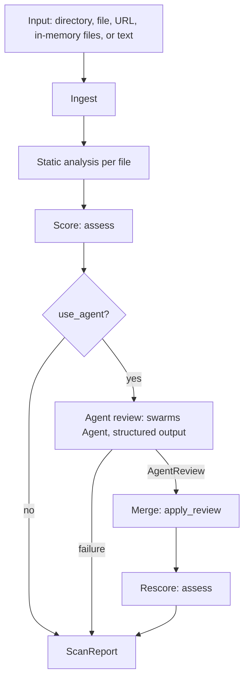

# How It Works

SkillScanner runs two independent review lines and merges them into one report.

## 1. Ingest

`scan(target)` decides what `target` is:

| Target | Handling |
| --- | --- |
| String starting with `http://` or `https://` | Fetched with `scan_url` (see below) |
| `Path`, or a string naming an existing file or directory | Read from disk (see below) |
| Single-line string without spaces that looks like a path (`/`, `\`, or a file extension) | `FileNotFoundError`, so a typo is never scanned as text |
| Any other string | Scanned as skill or prompt text with `scan_text` |

**URLs.** `scan_url` downloads the document (for example a raw `SKILL.md` or a prompt endpoint such as
`https://swarms.world/prompt/<id>.md`) and scans it as a single file named after the URL path. Every
request, including each redirect (up to 3), must resolve to a public IP address, so a scan request
cannot reach `localhost`, private networks, or cloud metadata endpoints. Downloads are limited to
`max_file_bytes`, time out after 15 seconds, and must be text.

**Paths.** A directory is walked (or a single file read) to build the set of files to analyze:

| Behavior | Detail |
| --- | --- |
| Skipped directories | `.git`, `.hg`, `.svn`, `node_modules`, `__pycache__`, `.venv`, `venv`, `.mypy_cache` |
| Symlinks | Never followed or read. A symlink whose target resolves outside the scanned root is reported as `SL001`. |
| File limit | After `max_files` files (default 1,000), scanning stops and `OB005` is reported. |
| Size limit | Files larger than `max_file_bytes` (default 1 MB) are not read and are reported as `OB003`. |
| Binary detection | A file with a NUL byte in its first 8 KB is binary. Executables (ELF, PE, Mach-O, Java class/fat binaries) are reported as `OB004`; other binaries as `OB006`, except common media and font files. |
| Decoding | Text is decoded as UTF-8; invalid bytes are replaced rather than failing the scan. |
| Components | Every file becomes a `component` with its type, line count, size, and whether it is executable (script extension, shebang, or executable permission bit). |

`scan_files()` and `scan_text()` skip the filesystem steps: the content you pass in is analyzed directly,
and executability is inferred from the file extension or a shebang.

## 2. Static Analysis

Each text file is analyzed independently by `skills_scanner.static.analyze_text`:

1. **Regex rules.** Every rule in the rule set runs over the full file text. A rule reports at most one
   issue per line. See [Detection Rules](detection-rules.md).
2. **Link analysis.** Every `http`, `https`, `ftp`, and `javascript:` URL is parsed and checked for
   deceptive authorities, interpolated secrets, raw or obfuscated IP hosts, known exfiltration and
   tunneling endpoints, URL shorteners, internationalized (homograph) domains, executable downloads,
   high-abuse TLDs, and unencrypted transport. `trusted_domains` exempts a domain from reputation checks.
3. **Hidden Unicode.** Unicode tag characters (invisible ASCII smuggling), supplementary variation
   selectors, bidirectional controls, and zero-width characters are detected. Tag-character text is
   decoded and shown in the report.
4. **Encoded payloads.** Base64 blobs of 40 or more characters that decode to readable text are reported
   and the decoded text is scanned again.

Hidden and encoded content is rescanned up to two levels deep. Findings inside it are reported at the line
where the payload appears, and their explanation ends with `(inside base64-decoded text)` or
`(inside hidden Unicode tag text)`.

Secrets are redacted in `finding` and `code_snippet`, and evidence is cleaned for display: invisible
characters are escaped (for example `\u200b`) and long matches are truncated.

## 3. Scoring

`assess()` turns the issues into a 0-100 risk score, a severity band, and a recommendation. Scoring is
confidence-weighted with diminishing returns for repeated matches of the same rule. See
[Scoring and Verdicts](scoring-and-verdicts.md).

## 4. Agent Review (optional)

When `use_agent` is true, a [Swarms](https://docs.swarms.world) `Agent` receives:

- the static risk score and every static issue with its `finding_id`
- the file contents, each wrapped in randomly tokenized `BEGIN/END UNTRUSTED FILE` markers with line numbers

It returns a structured `AgentReview`:

- `findings`: one judgment per static issue (is it a real vulnerability, confidence, intent, impact, explanation, remediation)
- `semantic_findings`: threats the static pass missed
- `overall_assessment`: verdict, risk level, summary, install posture, sensitive surface, diagnosis, guardrails

See [Agent Review](agent-review.md) for the prompt, model configuration, and failure handling.

## 5. Merge

`apply_review()` combines the agent's judgments with the static issues:

| Agent judgment | Result |
| --- | --- |
| Confirmed (`is_vulnerability: true`, confidence at least 0.6) | Issue keeps its severity; confidence becomes the higher of the two; `intent`, `explanation`, and `remediation` come from the agent |
| Not confirmed, rejected, or missing | Issue is kept unchanged and tagged `llm-unconfirmed`; the agent's reasoning, if any, is stored in `evidence.llm_judgment` |
| New threat (`semantic_findings`) | Added as issue `SEM1`, `SEM2`, ... tagged `semantic` |

Static issues are never removed or downgraded, so content that manipulates the agent cannot hide a
static finding. If the agent returns `APPROVE` while a HIGH or CRITICAL issue remains that it did not
explicitly clear, the verdict is lowered to `CAUTION`.

After merging, the score is recomputed, so confirmed issues (higher confidence) and semantic findings
raise it.

## 6. Report

The result is a `ScanReport` (see [Report Schema](report-schema.md)): skill identity, risk assessment,
components, issues sorted by severity then location, the agent's overall assessment, and metadata
describing whether the agent ran.
